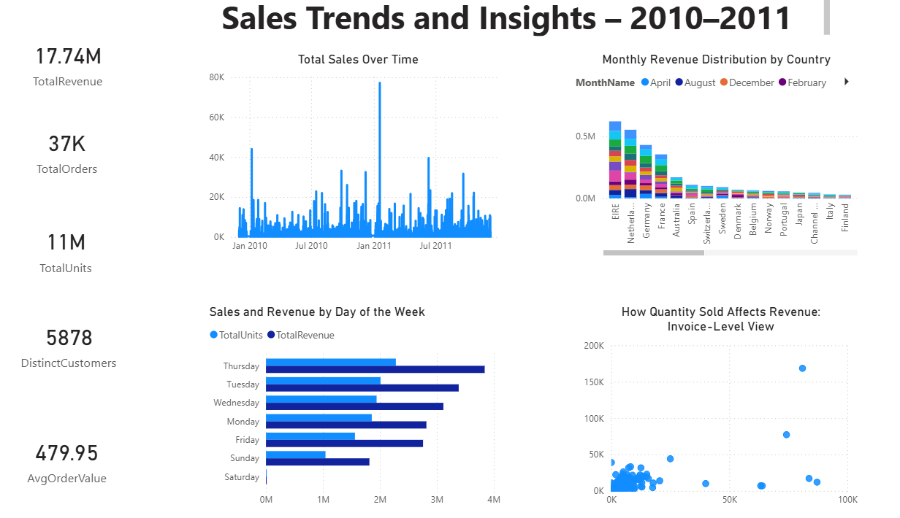

# 📊 Sales Performance Analysis & Insights Dashboard

A business intelligence dashboard built in Power BI to analyze real-world retail transactions, uncover revenue trends, and support strategic business decisions.

---

## 🧠 Key Insights
- **Thursday** alone contributed **22%** of weekly revenue, helping identify optimal promotion timing.
- Identified **B2B-like high-revenue orders**: 5% of invoices contributed 18% of revenue — critical for customer segmentation.
- Top 10 countries and products visualized to inform regional prioritization and stock allocation strategy.

---

## ⚙️ Tools & Technologies
- **Power BI** — for interactive data storytelling and KPI dashboards  
- **MySQL** — for scalable data handling and view creation  
- **Excel** — for raw data cleaning, reformatting, and sampling  
- **DAX** — for calculated columns, custom KPIs, and time intelligence

---

## 🧼 Preprocessing Summary
Before importing into SQL and Power BI, data was cleaned using Excel and MySQL:

- Re-formatted `InvoiceDate` to `YYYY-MM-DD HH:MM:SS`
- Resolved blank `CustomerID` issues by allowing NULLs
- Removed rows with non-positive quantity or price
- Used Excel to sample, trim, and transform large datasets for testing
- Reduced import time by 80% using `LOAD DATA INFILE` and manual formatting

---

## 📁 Project Files
- `SalesDashboard.pbix` — fully interactive Power BI report  
- `retail_sales_pipeline.sql` — full SQL pipeline: table creation, views, and revenue logic  
- `excel_preprocessing_steps.xlsx` — shows how raw data was cleaned and transformed  
- `assets/dashboard_preview.png` — snapshot of final dashboard UI  

> 📝 **Note:** Full dataset (`retail_sales_combined.csv`) not uploaded due to GitHub size limits. Sampled data and SQL pipeline are available for reproducibility.

---

## 🖼️ Dashboard Preview

---

## 💡 Use Cases
- Optimize **promotion timing** based on daily revenue patterns  
- Detect and segment **high-value B2B customers**  
- Identify **top-selling products and countries** to guide inventory and logistics  
- Build reusable data pipelines across Excel, SQL, and BI tools

---

## 📌 About
This project was developed to demonstrate end-to-end analytics skills for Data Analyst and Business Intelligence roles — from cleaning messy real-world data to surfacing meaningful business insights through clean, stakeholder-ready dashboards.
